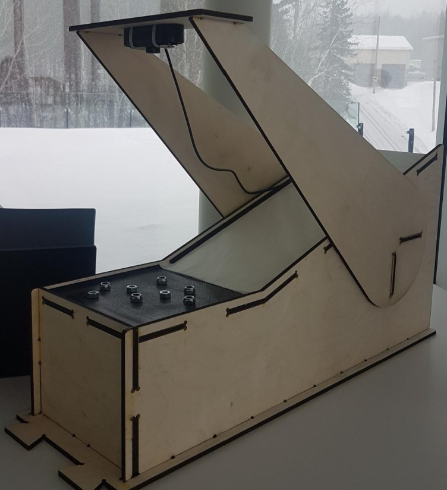

# Computer Vision
This section presents the way the computer vision pipeline works and how the training for the custom models was done.

## Training
The repository is not a tutorial on how to train a custom yolov4 model, but a summary of the process is presented here. 
As of now, yolov4 is not available on either PyTorch, nor TensorFlow, therefore we had to use the Darknet framework. 

### 1- Darknet installation
In order to install the Darknet framework we followed the instructions from the official YoloV4 GitHub (https://github.com/AlexeyAB/darknet).

We also followed TheCodingBug's Youtube playlist for further details on the installation steps (https://www.youtube.com/watch?v=FE2GBeKuqpc&list=PLUE9cBml08yiahlgN1BDv_8dAJFeCIR1u&index=2).

### 2- Data collection
We collected the data in a setting resembling as closely as possible our actual use case. Therefore, we had to build the slide before collecting our data, so we could take pictures of the nuts at a fix distance with the same background in different lightings. This allows the model to train itself on a more representative data set to make sure it is as accurate as possible in this setting.

### 3- Labeling
We labeled our data using a yolo compatible software called labelImg, from this GitHub: https://github.com/tzutalin/labelImg.

### 4- Training
We used the default Darknet framework to train our data. We simply followed the steps explained in the official YoloV4 GitHub (https://github.com/AlexeyAB/darknet).
Since we wanted to run the inference on a Raspberry Pi, we used YoloV4's "tiny" version.

### 5- Transfering the model from Darknet to TensorFlow Lite
In order to run the inference smoothly on the Raspberry Pi, we also converted the model to TensorFlow Lite using this GitHub: https://github.com/hunglc007/tensorflow-yolov4-tflite.

## Inference pipeline

