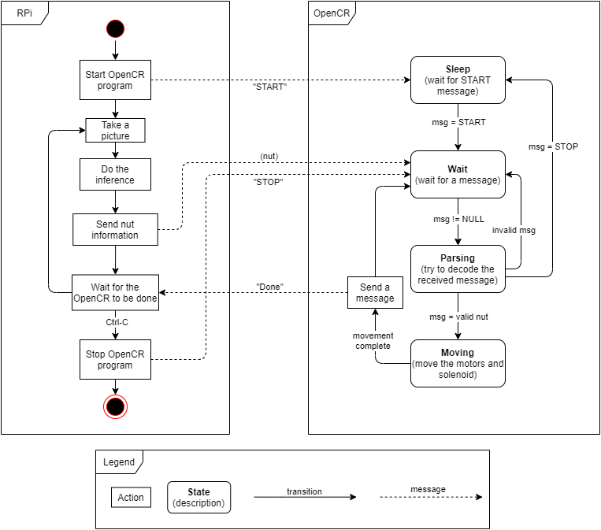

# _main_ folder
This folder contains all the C++ code that runs on the OpenCR. The purpose of the different files is [described here](#files) and a diagram of the [program structure](#program-structure) is also shown.

## Files
- __actuators.cpp__ : This file contains all the functions to control the robot's movements (motors and solenoids).
- __comm_functions.cpp__ : This file contains all the functions required for the communication with the Raspberry Pi over the Serial port.
- __inverse_kinematics.cpp__ : This file contains the math functions to convert a 2D coordinate to motor angles.
- __nut.h__ : This file contains the definition of the Nut type.
- __main.ino__ : This is the main sketch file (main program for the OpenCR).

## Program structure
The following image shows the main structure of the program running on the Raspberry Pi and the progam running on the OpenCR.

